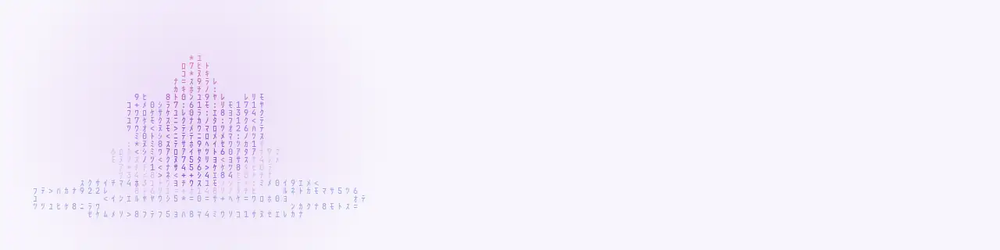
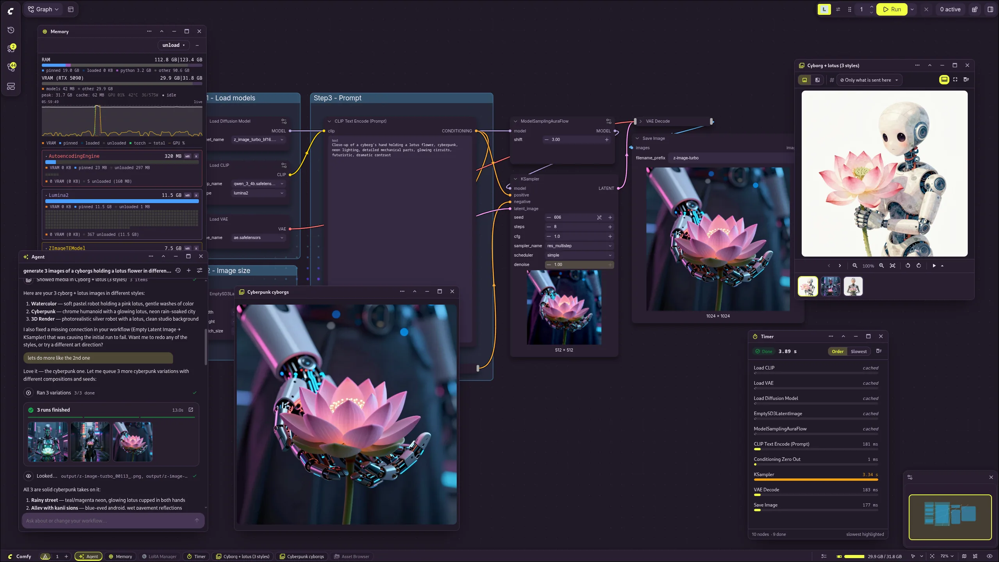

<p align="center">
  <picture>
    <source media="(prefers-color-scheme: dark)" srcset="docs/assets/banner-dark.webp">
    
  </picture>
</p>

<p align="center">
  <a href="https://registry.comfy.org/publishers/nynxz/nodes/comfyui-zenkit"></a>
  <a href="https://www.npmjs.com/package/@nynxz/zenkit-client"></a>
  <a href="LICENSE"></a>
  <a href="https://github.com/Nynxz/ZenKit/wiki"></a>
</p>

ZenKit turns ComfyUI into a calm, tidy workspace: dockable panels, a taskbar, full-screen
apps and swappable themes. It also gives other plugins one shared toolkit to build on, so
they look and behave alike. ZenKit itself adds no nodes.



## What you get

|                           |                                                                              |
| ------------------------- | ---------------------------------------------------------------------------- |
| **Panels and workspaces** | Floating, docking and tiling windows that remember where you left them       |
| **Taskbar and apps**      | A permanent taskbar, a launcher, and full-screen apps with their own routes  |
| **Themes**                | 25 theme packs, written as plain JSON, that restyle ComfyUI and every plugin |
| **Canvas backgrounds**    | Animated or image backgrounds behind the graph, with dim, frost and effects  |
| **Media and channels**    | A shared viewer, a named media bus, and refs that pass images between tools  |
| **Capabilities**          | Actions plugins offer each other, which agents can call as tools             |
| **UI kit**                | Around 40 themed Vue components, published as `@nynxz/zenkit-ui`             |

## Install

Search for **ZenKit** in ComfyUI-Manager, or use the CLI:

```sh
comfy node install comfyui-zenkit
```

Restart ComfyUI and the taskbar appears. Add [ZenSuite](https://github.com/Nynxz/ZenKit/wiki/Plugins)
for the Media Viewer, Asset Browser and Timer.

## Build on it

One call registers everything your plugin adds. It quietly does nothing when ZenKit isn't installed.

```ts
import { registerZenPlugin, mountVue } from '@nynxz/zenkit-client'
import Stash from './Stash.vue'

registerZenPlugin({
  id: 'stash',
  plugin: 'Stash',
  panels: [{ id: 'main', title: 'Stash', icon: 'mdi mdi-archive', render: mountVue(Stash) }],
  capabilities: [
    { id: 'search', description: 'Find saved images by text', run: ({ q }) => search(String(q)) },
  ],
})
```

Writing a node pack instead? [`@nynxz/zenkit-nodekit`](https://github.com/Nynxz/ZenKit/wiki/Nodekit-Pack-Pattern)
puts Vue widgets inside nodes, and works with or without ZenKit.

## Plugins

ComfyUI-ZenKit is the host. Two plugins ship alongside it today:

- **ZenSuite**: Media Viewer, Asset Browser and Timer panels.
- **ZenInspector**: shows what every node pack and extension actually registered.

More are in progress. See [Plugins](https://github.com/Nynxz/ZenKit/wiki/Plugins).

## Docs

Everything else is in the **[wiki](https://github.com/Nynxz/ZenKit/wiki)**:
[getting started](https://github.com/Nynxz/ZenKit/wiki/Your-First-Plugin) ·
[guides](https://github.com/Nynxz/ZenKit/wiki/Panels-and-Workspaces) ·
[API reference](https://github.com/Nynxz/ZenKit/wiki/API-Reference) ·
[UI components](https://github.com/Nynxz/ZenKit/wiki/UI-Components) ·
[contributing](https://github.com/Nynxz/ZenKit/wiki/Contributing).
The wiki is generated from [`docs/wiki`](docs/wiki), so fixes go through pull requests.

## Develop

```sh
pnpm install
pnpm check    # build, then lint, format and typecheck everything
```

See [Contributing](https://github.com/Nynxz/ZenKit/wiki/Contributing) for the repo layout and the release flow.

## License

Released under the [MIT License](LICENSE). © 2026 Henry Lee.
