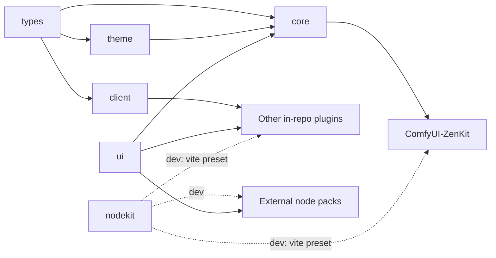

# Packages

ZenKit is a pnpm monorepo of six packages and six ComfyUI plugins. This page says what each one
is for, who imports it, and which one you need.

## Which one do I need?

| You are building…                                                               | Install                                                   |
| ------------------------------------------------------------------------------- | --------------------------------------------------------- |
| A **ZenKit plugin**: panels, apps, taskbar widgets, themes, capabilities        | `@nynxz/zenkit-client` (+ `@nynxz/zenkit-ui` for widgets) |
| A **node pack** with Vue widgets in node bodies, working with or without ZenKit | `@nynxz/zenkit-nodekit` (dev) + `@nynxz/zenkit-ui`        |
| Only want the themed Vue components                                             | `@nynxz/zenkit-ui`                                        |
| Only want the `window.ZenKit` types                                             | `@nynxz/zenkit-client` (it re-exports every type)         |

A ZenKit plugin and a node pack differ in what happens without ZenKit installed:

|                                  | ZenKit plugin                                            | Node pack                                                             |
| -------------------------------- | -------------------------------------------------------- | --------------------------------------------------------------------- |
| Talks to `window.ZenKit` through | `@nynxz/zenkit-client`                                   | nodekit's own small wrappers (no client import)                       |
| Without ComfyUI-ZenKit           | `registerZenPlugin` runs its `fallback`, or does nothing | Widgets render in the node; panels, slot links and the viewer degrade |
| Vue and zenkit-ui                | Usually shared from the runtime (`sharedRuntime: true`)  | Bundled into the pack's `main.js`                                     |
| Start here                       | [Your first plugin](Your-First-Plugin.md)                | [Nodekit pack pattern](Nodekit-Pack-Pattern.md)                       |

See [Working without ZenKit](Working-Without-ZenKit.md) for the degradation rules.

## Packages

| Package                 | Folder             | On npm                    | What it is                                                                                                                                                                              | Who imports it                                                        |
| ----------------------- | ------------------ | ------------------------- | --------------------------------------------------------------------------------------------------------------------------------------------------------------------------------------- | --------------------------------------------------------------------- |
| `@nynxz/zenkit-types`   | `packages/types`   | yes (raw `.ts`, no build) | The `window.ZenKit` contract. Types only.                                                                                                                                               | `client`, `core`, `theme`. Not consumers: import types from `client`. |
| `@nynxz/zenkit-client`  | `packages/client`  | yes                       | Typed SDK for `window.ZenKit`. Every call waits for the runtime and no-ops without it. Re-exports all of `types`.                                                                       | ZenKit plugins                                                        |
| `@nynxz/zenkit-ui`      | `packages/ui`      | yes                       | 41 Vue components styled from `--zen-*` tokens. No `window.ZenKit` dependency.                                                                                                          | Plugins, node packs, `core`                                           |
| `@nynxz/zenkit-nodekit` | `packages/nodekit` | yes                       | A node pack's frontend: pack identity, widget mounting, node registration, the Vite preset, ambient `@comfy/*` types.                                                                   | Node packs (dev dependency); every in-repo plugin's `vite.config.mts` |
| `@nynxz/zenkit-theme`   | `packages/theme`   | no (private)              | Token engine and theme-pack registry.                                                                                                                                                   | `core` only                                                           |
| `@nynxz/zenkit-core`    | `packages/core`    | no (private)              | The runtime that installs `window.ZenKit`: panels, docks, workspaces, taskbar, theme bridge, bus, jobs, channels, apps, storage, backgrounds, viewer, capabilities, media, mask editor. | `plugins/ComfyUI-ZenKit` only                                         |

All packages are version `0.2.0`. The source has moved on since that release:

| Package                 | Unreleased, not yet on npm                                                                                                                                                                                                                                   |
| ----------------------- | ------------------------------------------------------------------------------------------------------------------------------------------------------------------------------------------------------------------------------------------------------------ |
| `@nynxz/zenkit-ui`      | 14 of the 41 components (ZenMentionInput, ZenResolution, ZenVolume, ZenCurveEditor, ZenContextMenu, ZenMediaControls, ZenMediaPicker, ZenTimeline, ZenStepChart, ZenFolderTree, the LoRA components) — see [UI components](UI-Components.md#component-index) |
| `@nynxz/zenkit-nodekit` | The media API (`readMediaDrop`, `mediaLibrary`, …) and `openZenPanel`'s `onClose` / `close({ keep })` / `focus()`                                                                                                                                            |

Peer dependencies:

| Package   | Peers                                                                                             |
| --------- | ------------------------------------------------------------------------------------------------- |
| `client`  | `vue ^3.5.0`                                                                                      |
| `ui`      | `vue ^3.5.0`                                                                                      |
| `nodekit` | `vue ^3.5.0`, plus optional `vite ^6 \|\| ^7 \|\| ^8` and `@vitejs/plugin-vue >=5` (for `./vite`) |
| `core`    | `vue ^3.5.0`                                                                                      |

> Note: the published `@nynxz/zenkit-client` build bundles its own copy of Vue
> (`packages/client/vite.config.mts` externalises only `@comfy/app` and `@nynxz/zenkit-types`).
> In-repo plugins are unaffected because they alias `client` to source. An npm consumer that also
> bundles Vue ends up with two copies.

### Package entry points

| Import                                     | Gives you                                                                                                   |
| ------------------------------------------ | ----------------------------------------------------------------------------------------------------------- |
| `@nynxz/zenkit-ui`                         | Components, composables, types                                                                              |
| `@nynxz/zenkit-ui/style.css`               | The components' CSS                                                                                         |
| `@nynxz/zenkit-ui/comfy-bridge.css`        | Maps ComfyUI's CSS variables onto `--zen-*`, for use without the runtime                                    |
| `@nynxz/zenkit-nodekit`                    | Browser runtime (see [Nodekit pack pattern](Nodekit-Pack-Pattern.md))                                       |
| `@nynxz/zenkit-nodekit/vite`               | `zenPluginConfig`, `zenRuntimeConfig`, `ZENKIT_RUNTIME` (Node-only)                                         |
| `@nynxz/zenkit-nodekit/comfy.d.ts`         | Ambient `@comfy/app` and `@comfy/api` declarations                                                          |
| `@nynxz/zenkit-nodekit/tsconfig.pack.json` | A baseline tsconfig (see the tsconfig note in [Nodekit pack pattern](Nodekit-Pack-Pattern.md#tsconfigjson)) |

## Dependency direction

Arrows point from a package to the things that import it.

- `ui` and `nodekit` are standalone at runtime: no imports from other ZenKit packages.
- `nodekit` lists `@nynxz/zenkit-types` as a dev dependency but its source never imports it.
- External node packs do not use `client`. nodekit reads `window.ZenKit` directly.

## Plugins

| Plugin                         | Role                                                              | Details                                    |
| ------------------------------ | ----------------------------------------------------------------- | ------------------------------------------ |
| `plugins/ComfyUI-ZenKit`       | The host. Installs `window.ZenKit` and serves the shared runtime. | [Plugins](Plugins.md#comfyui-zenkit)       |
| `plugins/ComfyUI-ZenSuite`     | Media Viewer, Asset Browser, Timer, channel nodes                 | [Plugins](Plugins.md#comfyui-zensuite)     |
| `plugins/ComfyUI-ZenInspector` | Install-wide debug panel                                          | [Plugins](Plugins.md#comfyui-zeninspector) |

None of the plugins are npm packages. Every plugin except ComfyUI-ZenKit is built with
`sharedRuntime: true`, so it requires ComfyUI-ZenKit to be installed.

## Real consumers outside this repo

| Pack               | Uses                                                                       |
| ------------------ | -------------------------------------------------------------------------- |
| ComfyUI-NynxzNodes | nodekit + ui: ~12 widgets, frontend-only nodes, LoRA picker, popout editor |
| ComfyUI-ZenCut     | nodekit + ui: one widget (a video editor), media picker, popout editor     |

Both are the reference for [Nodekit pack pattern](Nodekit-Pack-Pattern.md).
